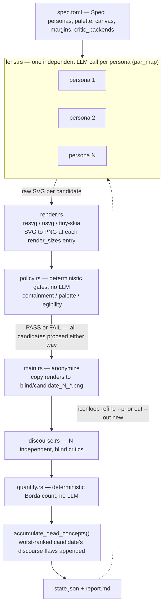
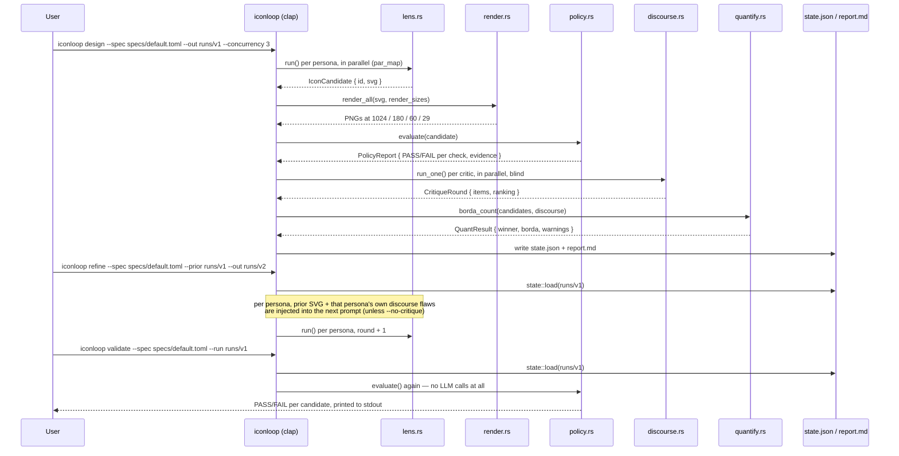
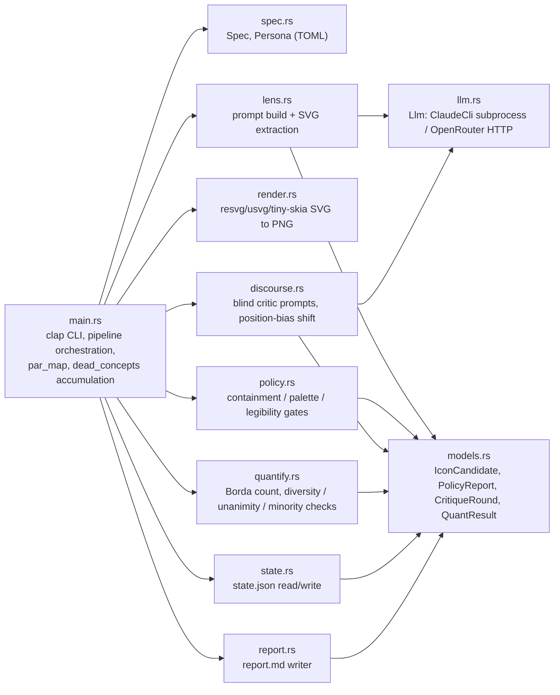
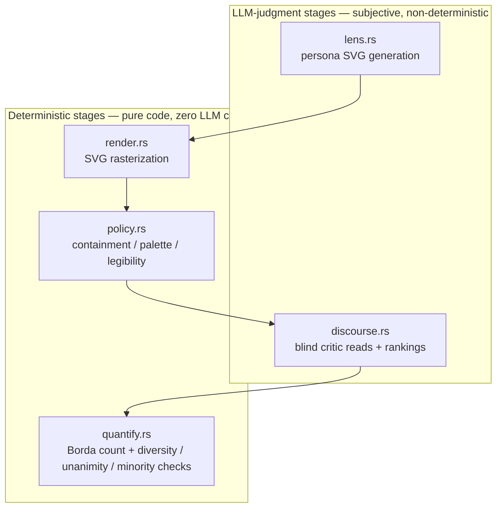
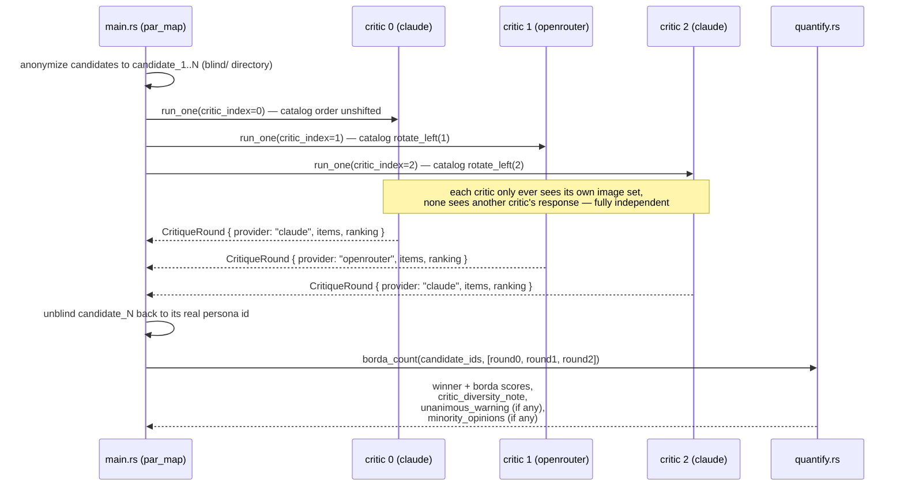
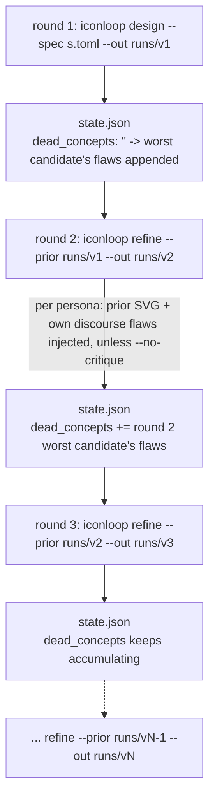

# icon-loop

[](LICENSE)

**icon-loop** is a Rust CLI (`iconloop`) that designs app icons through a five-stage pipeline —
**lens → render → policy → discourse → quantify** — instead of hand-iterating an image-generation
prompt and eyeballing the PNG. Icon candidates are generated as flat SVG by independent LLM
"personas," rasterized and checked against deterministic geometry/color/legibility gates, then
judged by a panel of critics who never see each other's opinions or which persona made which
candidate, and finally ranked by a plain deterministic Borda count.

It is part of the [Loop-Suite](https://github.com/Loop-Suite) family of pattern-sharing CLIs
(`Code-Review-Loop`, `codedesign-loop`, …), adapted here for icon design.

## Why this exists

Re-prompting an image model and eyeballing the result has three recurring failure modes:

- **Geometry silently drifts outside the canvas or collapses at small sizes** (a real app icon
  renders at 29px), and this is easy to miss until several regenerations in.
- **A maker — human or a single LLM asked to grade its own output — is structurally bad at seeing
  its own blind spot.** A shape intended to read as one thing can read as something else entirely
  to a fresh viewer.
- **A "panel" of critics that is the same model called three times is not a panel.** If the judges
  are correlated, N of them collapse to far fewer effective, independent votes.

`icon-loop` addresses each mechanically: `policy.rs` catches the first with pixel math, not taste;
`discourse.rs` catches the second by keeping every critic blind to persona identity and to each
other; `quantify.rs` catches the third by tracking critic-provider diversity and flagging
suspiciously unanimous verdicts instead of just accepting them.

## Pipeline



Note the middle arrow: policy PASS/FAIL is recorded per candidate and surfaced in `report.md`, but
in the current implementation it does **not** filter candidates out of discourse — every candidate
that came out of `lens.rs`, whether it passed the deterministic gates or not, still gets rendered,
anonymized, and shown to every critic. The gate is diagnostic, not (yet) an exclusion filter.

## Requirements / build

- Rust toolchain (edition 2021)
- `claude` CLI on `PATH` — the default backend, invoked as a subprocess; no separate API key
  required for it
- optional: `OPENROUTER_API_KEY` environment variable, for critic-panel provider diversity (see
  [Backends](#backends-claude-cli-vs-openrouter) below) — without it, any critic slot assigned
  `"openrouter"` in the spec falls back to `claude` and the run logs why

```bash
cargo build --release
# binary at target/release/iconloop
```

Core dependencies (`Cargo.toml`): `clap` (derive) for the CLI, `resvg`/`usvg`/`tiny-skia` for pure-Rust
SVG rasterization (no external `rsvg-convert` subprocess), `ureq` for the OpenRouter HTTP calls,
`serde`/`serde_json`/`toml` for spec and state (de)serialization, `regex` for the palette gate,
`base64` for image attachments, `anyhow` for error handling.

## Commands



### Global flags

These apply to every subcommand (`clap` `global = true`):

| flag | default | effect |
|---|---|---|
| `--claude-bin <STR>` | `claude` | binary name/path used for every Claude CLI subprocess call |
| `--backend <claude\|openrouter>` | `claude` | backend for the **lens** (persona generation) LLM only — see callout below |
| `--model <STR>` | none | model override, passed through to `--backend`'s lens LLM |
| `--retries <N>` | `2` | retry attempts per LLM call (`llm.rs`) |
| `--verbose` | off | print retry diagnostics to stderr |

> **`--backend`/`--model` control only `lens.rs`'s generation LLM.** The discourse critics are
> wired up separately in `main.rs`: a `claude`-backend critic always uses `Llm::claude_cli` with
> the default model, and an `openrouter`-backend critic is built from the spec's own
> `openrouter_critic_model` field — not from `--model`. Which critic slots use which provider is
> controlled entirely by the spec file's `critic_backends` list (see [Spec format](#spec-format)),
> independent of these CLI flags.

### `design`

Run a fresh round from a spec.

```bash
iconloop design --spec specs/default.toml --out runs/v1 --concurrency 3
```

| flag | default | |
|---|---|---|
| `--spec <PATH>` | required | spec TOML file |
| `--out <PATH>` | `runs/design` | output directory — refuses to run if `state.json` already exists there |
| `--concurrency <N>` | `3` | max parallel LLM calls (shared by lens and discourse stages via `par_map`) |

Output layout:

```text
runs/v1/
├── report.md   # ranking, deterministic gate results, raw critic text, minority opinions, warnings
├── state.json  # full round state, consumed by `refine --prior` and `validate --run`
├── render/     # per-candidate PNGs at every render_sizes entry (real persona id in filename)
└── blind/      # the anonymized candidate_N_*.png files actually shown to discourse critics
```

### `refine`

Feed the previous round's SVG and critique text back into the next round's generation prompt.
Always requires a fresh `--out` — it never overwrites a prior run.

```bash
iconloop refine --spec specs/default.toml --prior runs/v1 --out runs/v2
```

| flag | default | |
|---|---|---|
| `--spec <PATH>` | required | spec TOML file |
| `--prior <PATH>` | required | prior run's directory (containing `state.json`) |
| `--out <PATH>` | required | fresh output directory |
| `--concurrency <N>` | `3` | same as `design` |
| `--no-critique` | off | ablation switch, see below |

`--no-critique` drops each persona's own "here is your last SVG and what the critics said about
it" block while keeping the shared `dead_concepts` memory intact. It exists to let you compare a
round with and without per-persona critique injection, to check whether critique text is actually
doing anything or whether apparent round-over-round improvement is just regeneration noise (see
[Limitations](#limitations)).

### `validate`

Re-run the deterministic policy gates on a saved `state.json` — no LLM calls at all. Useful after
editing a spec's palette or margins to see whether existing candidates would still pass.

```bash
iconloop validate --spec specs/default.toml --run runs/v1
```

## Architecture



| file | responsibility |
|---|---|
| `src/main.rs` | `clap` CLI (`Design` / `Refine` / `Validate`), builds the right `Llm` per stage, runs the pipeline, accumulates `dead_concepts` |
| `src/spec.rs` | `Spec`/`Persona` TOML schema and loader with basic invariant checks |
| `src/lens.rs` | builds the per-persona generation prompt, calls the LLM, extracts the `<svg>…</svg>` slice from the raw response |
| `src/llm.rs` | `Llm` abstraction over two providers: Claude CLI subprocess and OpenRouter HTTP |
| `src/render.rs` | SVG → PNG rasterization via `resvg`/`usvg`/`tiny-skia`, purely in-process (no external binary) |
| `src/policy.rs` | deterministic containment / palette / legibility checks against the rendered pixels |
| `src/discourse.rs` | builds the blind critic prompt, rotates catalog order per critic, calls the LLM with attached images, validates the returned ranking |
| `src/quantify.rs` | Borda count aggregation plus diversity/unanimity/minority-opinion analysis |
| `src/models.rs` | shared data types serialized into `state.json` and consumed by `report.rs` |
| `src/state.rs` | `state.json` read/write |
| `src/report.rs` | renders `report.md` from the round's candidates, policy reports, discourse rounds, and quant result |

## Spec format

A spec is a TOML file (see `specs/default.toml`) with the following fields:

| field | meaning |
|---|---|
| `name` | run/spec identifier |
| `context` | free-text product brief, injected into both lens and discourse prompts |
| `canvas` | square canvas size in px (e.g. `1024`) |
| `margin_ratio` | fraction of canvas each edge that must stay empty (containment gate) |
| `render_sizes` | list of px sizes rendered for every candidate (e.g. `[1024, 180, 60, 29]`) |
| `legibility_size` | which of `render_sizes` the legibility gate measures (e.g. `29`) |
| `min_fg_ratio` / `max_fg_ratio` | allowed foreground-pixel fraction at `legibility_size` |
| `background_hex` | background color, also the "not foreground" reference color for pixel scans |
| `palette` | list of hex colors the generated SVG's `fill` attributes must stay within |
| `n_critics` | number of independent discourse critics per round |
| `critic_backends` | list cycled by critic index (`critic_backends[i % len]`) — `"claude"` or `"openrouter"`, defaults to `["claude"]` if omitted |
| `openrouter_critic_model` | model used for `"openrouter"`-backend critics, defaults to `x-ai/grok-4.5` |
| `personas` | list of `{ id, persona_name, philosophy }` — one independent lens call each |

The shipped example (`specs/default.toml`) targets a fictional divination/fortune-telling app icon
and defines three personas, each with a genuinely different structural constraint rather than just
a different prompt "temperature":

| id | persona | constraint |
|---|---|---|
| `glyph` | Ancient Glyph Carver | reinterpret shared divination visual vocabulary (e.g. stacked bars) geometrically, never a literal copy |
| `negspace` | Negative-Space Minimalist | one thick, safe outer silhouette + a single negative-space cut, nothing else |
| `crystal` | Crystal Facet Sculptor | a compact, closed polyhedron — facets never extend past the outer silhouette |

The default spec's `critic_backends = ["claude", "openrouter", "claude"]` mixes providers across
its 3 critics rather than using one provider three times.

## Deterministic gates vs. LLM judgment



`policy.rs`'s three checks all operate on actual rendered pixels (via `usvg`/`resvg`'s `Pixmap`),
not on regex-parsed path coordinates, so stroke width and curve overshoot are naturally accounted
for:

- **containment**: scans the native-size render for any pixel that doesn't exactly match
  `background_hex`; the resulting bounding box must fit inside `margin_px() - 3px` of anti-aliasing
  tolerance on every edge.
- **palette**: regex-matches every literal `fill="#rrggbb"` in the raw SVG source and fails if any
  hex isn't in the spec's `palette` list.
- **legibility**: at `legibility_size` (29px by default), the foreground-pixel fraction must fall
  within `[min_fg_ratio, max_fg_ratio]` — too sparse means the shape vanishes at real icon sizes,
  too dense means it smears into a blob.

`quantify.rs`'s Borda count, diversity note, unanimity warning, and minority-opinion list are all
plain arithmetic over the critics' JSON rankings — no LLM call happens after `discourse.rs` returns.

## Discourse: independent, blind critics

This is the one place `icon-loop`'s shape diverges from sequential, turn-taking multi-agent
debate. Critics never see each other's output; each gets the same anonymized image set (with a
per-critic cyclic shift of catalog order to cancel out position bias) and answers independently in
a fixed JSON schema (`{"items": [...], "ranking": [...]}`).



Each critic call is backed by whichever provider `critic_backends[critic_index % len]` selects.
Regardless of provider, the prompt asks for the same four fields per candidate — `blind_read`
(first impression with no context), `category_signal`, `legibility_29px`, `biggest_flaw` — plus a
full, tie-free `ranking`. Attached images must be listed in exactly the same shifted order as the
prompt's text catalog; `discourse.rs` documents a real bug this project hit when that invariant
briefly broke (see [Validated on real runs](#validated-on-real-runs)).

`quantify.rs` then separately:

- flags **unanimous agreement** across critics as something to double-check, not just celebrate —
  the accompanying `critic_diversity_note` (which providers were actually mixed in) tells you
  whether unanimity is more likely genuine agreement or provider correlation.
- surfaces **minority opinions**: a candidate that lost the overall Borda vote but that one
  specific critic ranked first, so a strong idea liked by only one judge doesn't silently vanish
  into the aggregate.

## Refine loop and `dead_concepts`

Round state carries forward as accumulated free text, not a fixed enum: `dead_concepts` collects
the Borda-lowest-ranked candidate's concrete discourse flaws (tagged with which critic/provider
raised each one) after every round, so the next round's personas don't repeat a shape that already
failed. Each persona optionally also receives its own specific prior SVG and critique text (unless
`--no-critique` is passed), on top of the shared `dead_concepts` memory.



Each `dead_concepts` entry records how many critics raised it, so a persona can weigh a flaw
several critics agreed on against one only a single critic flagged, rather than over-correcting on
a possible false positive.

## Backends: Claude CLI vs. OpenRouter

| | Claude CLI | OpenRouter |
|---|---|---|
| invocation | subprocess (`Command::new(claude_bin)`) | HTTPS POST to `openrouter.ai/api/v1/chat/completions` |
| auth | none needed beyond the CLI being logged in | `OPENROUTER_API_KEY` env var |
| text-only calls (lens) | `-p --output-format json --safe-mode --disable-slash-commands --no-session-persistence --tools ""` (all tools disabled) | plain string message content |
| image calls (discourse) | `--tools Read --allowedTools Read --add-dir <blind/>` — the critic opens PNGs by path itself | images base64-encoded as `data:` URIs and attached directly to the message |
| default model | whatever `claude` itself defaults to | `openai/gpt-oss-120b` (general), overridden to `openrouter_critic_model` (`x-ai/grok-4.5` by default) for discourse critics |
| response parsing | `result` field of the CLI's JSON envelope | `choices[0].message.content` |

Text and image inputs reach the model differently per backend, but `discourse.rs`'s prompt is
provider-agnostic — from the critic's point of view, both backends end with "you looked at the
image."

## Validated on real runs

Documented findings from real rounds against the shipped example spec, not a synthetic fixture:

- **Round 1 (`design`)**: a persona reported its own triangle-with-eye design would read as
  intended. All independent blind critics instead read it as a mountain/spark shape — a mismatch
  the deterministic gates (containment, palette, legibility) all passed cleanly, since none of them
  evaluate what a shape actually looks like. This is the concrete case for why blind discourse is a
  separate stage from the policy gates, not a superset of them.
- **Round 2 (`refine`)**: feeding that critique back in changed the losing persona's next design
  entirely (triangle+eye → pentagon+crescent), and the new flaw critics found (read as a map pin)
  was milder than the one before it.
- **A real ordering bug this design caught in itself**: `discourse.rs` requires the attached-image
  order to match the shifted text catalog order exactly. An early version built those from
  different orderings, so an OpenRouter critic was silently grading candidate A's image under
  candidate B's label, one position off, every time a nonzero shift applied. Claude CLI critics
  never hit this because they open files by path via the `Read` tool rather than relying on
  attachment order. Fixing `discourse.rs` to derive the image list from the same `shifted` list as
  the text catalog turned an earlier *apparent* cross-provider disagreement (which was actually
  this bug) into a real, checkable-by-eye disagreement between providers on a later run.

## Empirical review findings

A review pass on this repo: two rounds of static code review found 3 real bugs, all fixed and
merged ([#2](https://github.com/Loop-Suite/Icon-Loop/issues/2),
[#3](https://github.com/Loop-Suite/Icon-Loop/issues/3),
[#4](https://github.com/Loop-Suite/Icon-Loop/issues/4)). The most rigorous part isn't the bug
count — for two of the three ([#3](https://github.com/Loop-Suite/Icon-Loop/issues/3)'s ranking
check accepting a duplicate+omitted candidate id pair at matching length, and
[#4](https://github.com/Loop-Suite/Icon-Loop/issues/4)'s policy gate comparing background color
RGB-only and misreading transparent canvas area as foreground on any non-black background), the
fix was verified by rolling back to the pre-fix commit and re-running the exact same adversarial
input: the original bug reproduced live on the unfixed tree and did not reproduce on the fixed
one. Both reproductions cost $0 — a local fake `claude` binary stood in for the real CLI for #3,
and the deterministic `iconloop validate` path (no LLM call involved) covered #4.

**Cost is unmeasured, not zero.** icon-loop doesn't log its own LLM call count or spend (no
`manifest.json`/`usage.calls` equivalent like Code-Review-Loop), so no dollar figure in this
document is a measured total, only a rough estimate. Full methodology, all three findings, and the
caveats: [evals/README.md](evals/README.md).

## Design rationale

Several implementation choices are directly informed by prior work on LLM-judge panels, cited in
the source comments:

- **Blind, parallel critics over sequential debate** — most of the measured benefit of multi-agent
  debate comes from ensembling/aggregation rather than the back-and-forth itself, and real-time
  mutual exposure mainly adds sycophancy risk; anonymization is reported to cut a measured
  conformity gap sharply (`discourse.rs` comments, citing arXiv:2508.17536 and arXiv:2510.07517).
- **Mixed critic providers** — correlated judges can make an N-critic panel behave like far fewer
  effective independent votes, and heterogeneous-provider panels are reported to correlate better
  with human judgment than a single strong judge, at lower cost (`spec.rs`/`llm.rs` comments,
  citing arXiv:2605.29800 and arXiv:2404.18796 — the "Panel of LLM evaluators" pattern).
  `quantify.rs`'s `critic_diversity_note` and `unanimous_warning` operationalize this: a unanimous
  verdict from providers that are all the same is treated as a weaker signal than one from a mixed
  panel.
- **Corroboration-weighted `dead_concepts`, not raw flaw text** — each accumulated flaw is tagged
  with which critic/provider raised it, so the next round's personas can weigh corroborated
  complaints over single-critic ones instead of over-correcting on a possible false positive
  (`main.rs` comments, citing arXiv:2502.08177 on regressive over-correction from sycophantic
  feedback loops).
- **`--no-critique` as an ablation switch** — isolates whether per-persona critique injection is
  doing real work, versus apparent round-over-round gains being regeneration variance (`main.rs`
  comments, citing arXiv:2406.01297 on self-refine improvement claims needing causal isolation).

## Limitations

- **`refine`'s apparent improvement hasn't been causally isolated.** Round-over-round gains could
  be the injected critique text working as intended, or just regeneration variance — a fresh sample
  from the same persona might score similarly with no feedback at all. Use `--no-critique` to
  compare before trusting a specific round-to-round delta.
- **A 3-critic, 2-provider panel is still a small panel.** Two providers is a floor, not a ceiling
  — nothing stops `critic_backends` from silently degrading toward one provider if
  `OPENROUTER_API_KEY` isn't set; the run still succeeds, with a logged warning and a matching
  `critic_diversity_note` in the report.
- **Policy PASS/FAIL doesn't currently exclude a candidate from discourse.** A candidate that fails
  containment/palette/legibility still gets rendered, anonymized, and voted on alongside passing
  candidates in this version.
- **Regressive over-correction is only partially guarded against.** `dead_concepts` tags each flaw
  with how many critics raised it, but nothing enforces a hard consensus threshold before a flaw
  gets fed into the next round's prompts.
- **Deterministic gates check geometry and pixels, not taste.** A design can pass every gate and
  still be generic or unappealing — that judgment stays with discourse and, ultimately, with
  whoever reads `report.md`.

## Lineage

`Code-Review-Loop` (original) → `codedesign-loop` (discourse pattern ported to pre-code design
review) → **icon-loop** (ported again to icon design, with discourse itself reshaped from
sequential debate into independent blind evaluation plus deterministic aggregation, per the
rationale above).
